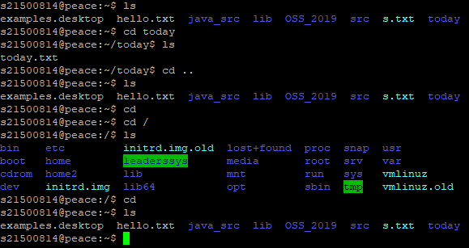

OSS 수업에서 리눅스 명령어들을 연습하고 블로그에 포스팅하라는 과제가 나왔습니다.

그런 이유로 이 글에서는 쓸모있을 것 같은 리눅스 명령어들을 간단한 사용법과 함께 적어보고자 합니다.


1. cd (change directory)

말 그대로 현재 디렉토리를 바꾸는 명령어
 
```c
cd /
```
-> 최상위 디렉토리로 이동
```c
cd ...
```
 -> 상위 디렉토리로 이동
```c
cd
```
 -> 홈 디렉토리로 이동

사용 예시)

#
</img>
